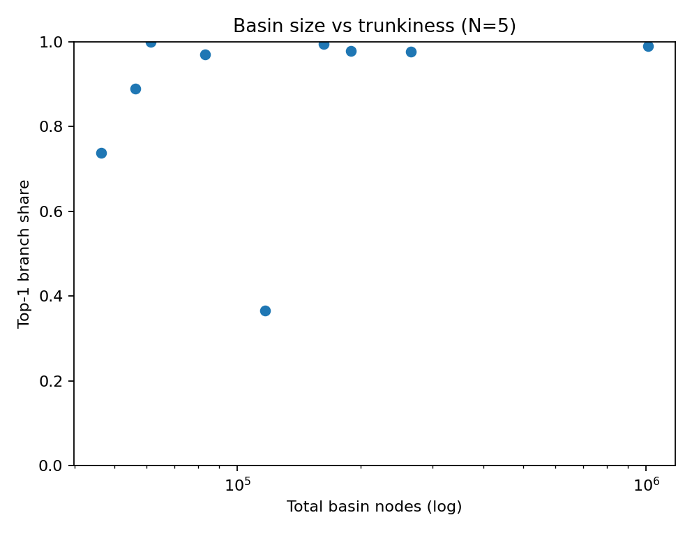
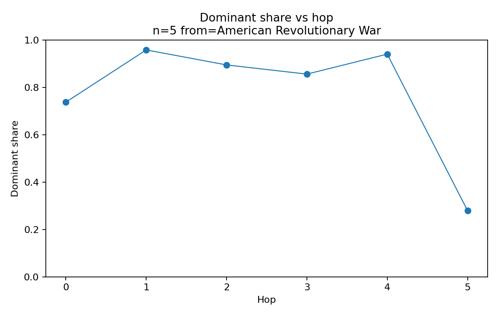
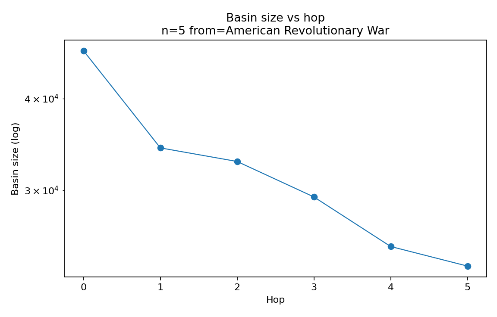
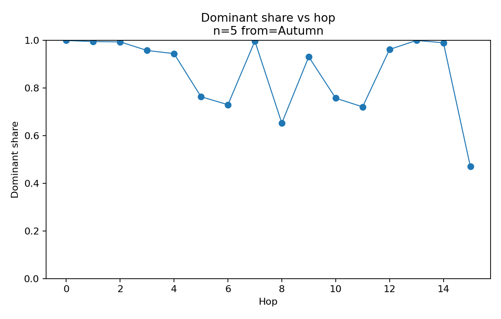
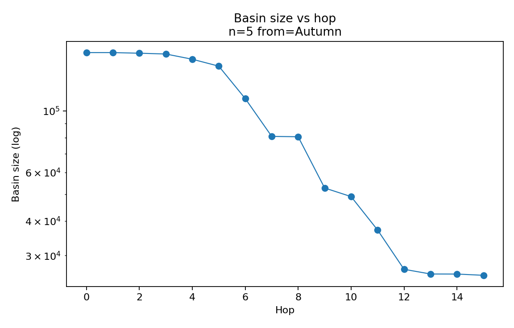
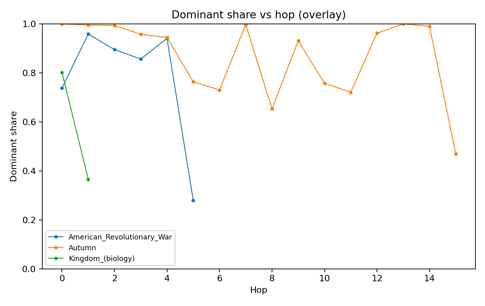

# N=5 Basin Structure — Human-Facing Summary (So Far)

        **Date**: 2025-12-30  
        **Scope**: Wikipedia fixed-$N$ rule with $N=5$ (the induced functional graph $f_5$).  
        **Goal**: Summarize what we’ve empirically learned about basin sizes, branch (“watershed”) structure, and dominant-upstream trunks.

        This report is generated from gitignored analysis artifacts under `data/wikipedia/processed/analysis/`.

        ## Key Takeaways

        - Basin sizes vary substantially in a small sample; a “giant basin” candidate exists (`Massachusetts ↔ Gulf_of_Maine`).
        - Many basins are highly *single-trunk* at depth 1: one predecessor subtree captures most upstream mass.
        - “Non-trunky” at hop 0 does not imply “non-trunky” upstream: dominant-upstream chase can quickly enter high-dominance regimes.
        - Dominance can later *collapse* (shares plunge) as the chase enters diffuse / long-tail regions.

        ## Trunkiness Dashboard

        Dashboard input:
        - `data/wikipedia/processed/analysis/branch_trunkiness_dashboard_n=5_test_2026-01-01.tsv`

        **Charts**:
        - 
        - 

        **Preview table**:

        | cycle_key                                                                 | total_basin_nodes | top1_share_total | effective_branches | dominant_entry_title | dominant_enters_cycle_title |
| ------------------------------------------------------------------------- | ----------------- | ---------------- | ------------------ | -------------------- | --------------------------- |
| Thermosetting_polymer__Curing_(chemistry)_reproduction_2025-12-31         | 61353             | 0.9997           | 1.001              | Concrete             | Curing_(chemistry)          |
| Autumn__Summer_reproduction_2025-12-31                                    | 162689            | 0.9948           | 1.010              | Mediterranean_basin  | Summer                      |
| Massachusetts__Gulf_of_Maine_reproduction_2025-12-31                      | 1009471           | 0.9894           | 1.022              | Connecticut          | Massachusetts               |
| Mountain__Hill_reproduction_2025-12-31                                    | 189269            | 0.9786           | 1.044              | Mountain_range       | Hill                        |
| Sea_salt__Seawater_reproduction_2025-12-31                                | 265940            | 0.9770           | 1.047              | Fast_ice             | Seawater                    |
| Latvia__Lithuania_reproduction_2025-12-31                                 | 83403             | 0.9692           | 1.064              | Poland               | Lithuania                   |
| Precedent__Civil_law_reproduction_2025-12-31                              | 56314             | 0.8888           | 1.252              | Constitution         | Precedent                   |
| American_Revolutionary_War__Eastern_United_States_reproduction_2025-12-31 | 46437             | 0.7379           | 1.800              | George_Washington    | American_Revolutionary_War  |
| Kingdom_(biology)__Animal_reproduction_2025-12-31                         | 116998            | 0.3658           | 5.051              | Brain                | Animal                      |

        ## Dominance Collapse (Threshold Run)

            Collapse dashboard input:
            - `data/wikipedia/processed/analysis/dominance_collapse_dashboard_n=5_test_2026-01-01.tsv`

            Preview (sorted by min share):

            | seed_title                 | first_below_threshold_hop | min_share | stop_reason     | stop_at_title                     |
| -------------------------- | ------------------------- | --------- | --------------- | --------------------------------- |
| American_Revolutionary_War | 5.0                       | 0.280     | share_below_0.5 | California                        |
| Hill                       | 19.0                      | 0.282     | share_below_0.5 | Iran                              |
| Lithuania                  | 16.0                      | 0.355     | share_below_0.5 | Construction                      |
| Animal                     | 0.0                       | 0.366     | share_below_0.5 | Animal                            |
| Seawater                   | 12.0                      | 0.371     | share_below_0.5 | Canada                            |
| Summer                     | 14.0                      | 0.470     | share_below_0.5 | Adelaide                          |
| Precedent                  | 2.0                       | 0.479     | share_below_0.5 | Executive_(government)            |
| Curing_(chemistry)         |                           | 0.648     | max_hops        | Son_of_God_(Christianity)         |
| Massachusetts              |                           | 0.763     | max_hops        | Criminal_law_of_the_United_States |

        ## Example Chases (Dominant Share vs Hop)

        These are pulled from any available `dominant_upstream_chain_n=5_from=*.tsv` artifacts.

        - dominant_upstream_chain_n=5_from=American_Revolutionary_War.tsv
- dominant_upstream_chain_n=5_from=Autumn.tsv
- dominant_upstream_chain_n=5_from=Kingdom_(biology).tsv

        **Charts** (share + basin size per chase):

        - 
- 
- 
- 
- _share.png)
- _basin.png)

        **Overlay comparison**:

        - 

        ## How to Regenerate

        From repo root:
        - `python n-link-analysis/scripts/render-human-report.py --tag test_n2_validated`

        This rewrites:
        - `n-link-analysis/report/overview.md`
        - `n-link-analysis/report/assets/*.png`
